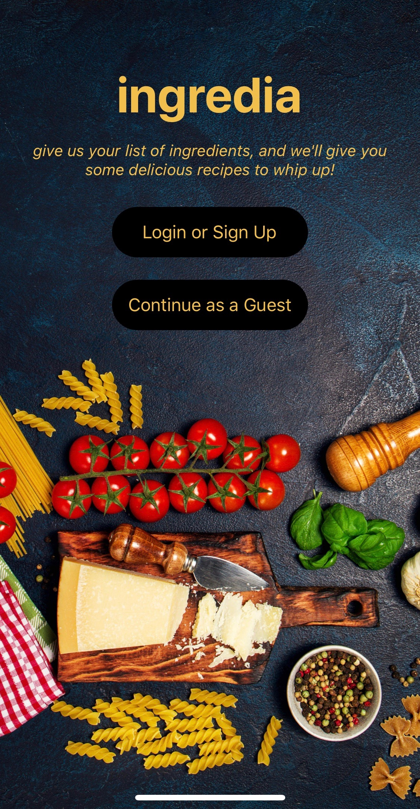
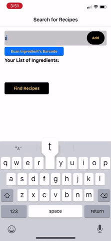
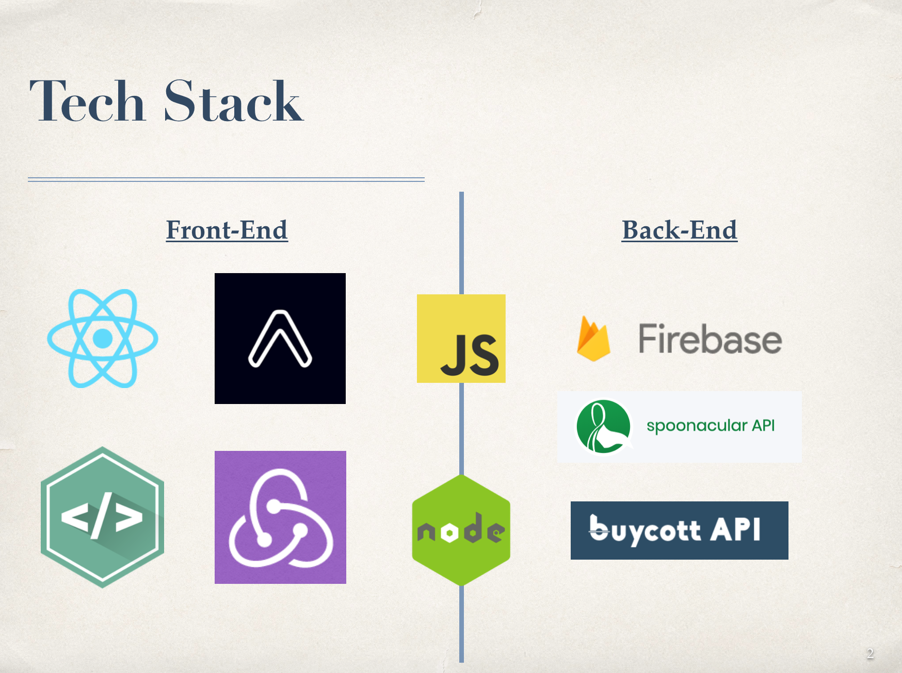

# ingredia 
#### Created by: Nayana Limaye, Gundeep Kohli and Kate Lei

## Overview
Inspired by our love for food and to spend money accordingly, we developed ingredia! It is a mobile application that we created with the intent of utilizing ingredients in your household that may otherwise go to waste. You know the ingredients you have sitting in your pantry or refrigerator that are probably going bad? Ingredia can help you with that! With its help, you can prepare some tasty recipes, and avoid feeling the guilt of throwing food away!

## User Experience

#### Guests :
Guests can easily search for recipes they can prepare with the ingredients that are available to them. They can either type in the ingredient or scan its barcode. The app will then render a list of recipes the user can whip up. If they select a recipe, they can view more information about that specific recipe, such as the preparation time, number of servings and the detailed steps.
 
#### Signed-up Users :
The users that have signed-up to use ingredia can log-in to their accounts. These users have access to all the features that guests have, in addition to the “My Recipes” tab. The "My Recipes" feature stores the user's “Past Recipes”, which contain the history of recipes made by that user, along with their “Wish List”. The "Wish List" is a collection of recipes saved by the user for future reference, or a recipe to prepare another time. 

## Architecture

ingredia was built using JavaScript in Node.js environment. The front-end was designed using React Native and Expo CLI. In addition, NativeBase components were applied for styling. Redux was used to maintain the state of the application, specifically for a logged in user. It held that user’s information, along with Past Recipes and Wish List data associated with that user. 

Instead of using a traditional RDBMS, we opted to use a NoSQL database. Cloud Firestore from Google Firebase was incorporated to maintain persistent data storage of user information, and the recipe data associated with each user.

We retrieved data from external APIs for the recipes, and ingredient information associated with a scanned barcode.

